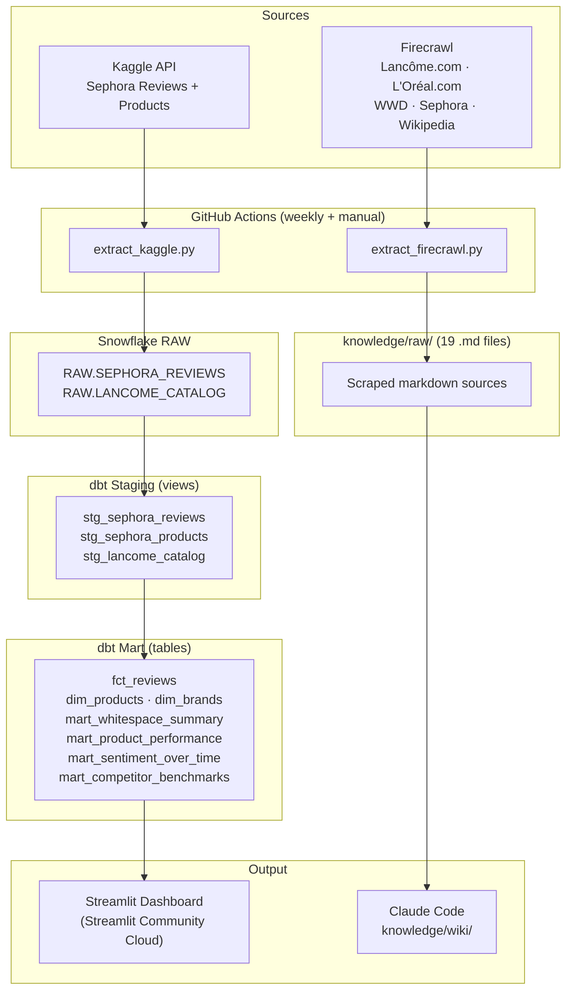
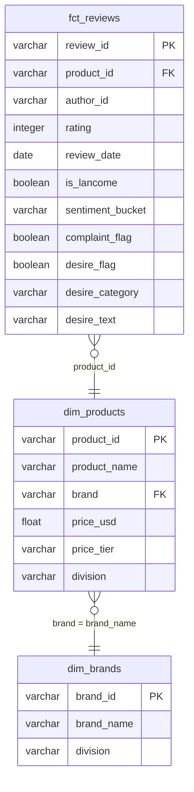
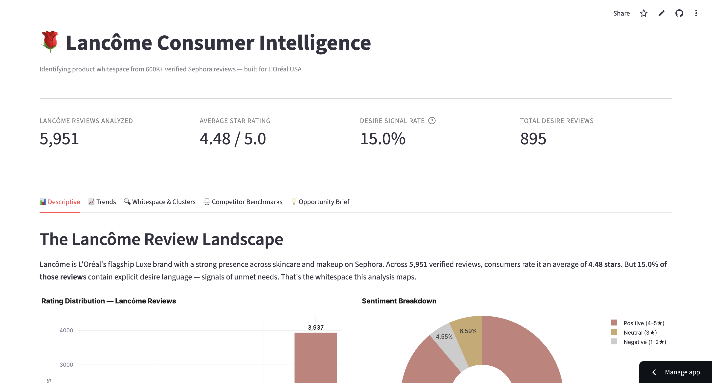

# L'Oréal Consumer Intelligence

This project identifies product whitespace opportunities for Lancôme by detecting desire language in 600K+ verified Sephora consumer reviews. It pulls structured review data from the Kaggle API, loads it into Snowflake, transforms it through a dbt star schema, and surfaces consumer insights through a deployed Streamlit dashboard. A parallel knowledge base — built from 19 scraped sources across Lancôme.com, L'Oréal.com, WWD, Sephora, and Wikipedia — provides brand and market context that makes the quantitative signals interpretable. The central output is a ranked whitespace analysis: which product gaps have the most consumers behind them, the most dissatisfaction, and the least competitive coverage.

---

## Job Posting

**Role:** Commercial Management Trainee
**Company:** L'Oréal USA
**Link:** https://www.wayup.com/i-Consumer-Goods-j-2026-LOreal-USA-Commercial-Management-Trainee-Program-LOreal-191011435582500/

This project directly demonstrates the role's core skill requirement — "generate insights and viable recommendations through data analysis across multiple sources" — by building a full consumer intelligence pipeline that joins product metadata, review sentiment, and brand knowledge to produce an actionable product launch recommendation.

---

## Tech Stack

| Layer | Tool |
|---|---|
| Source 1 | Kaggle API — Sephora Products & Skincare Reviews dataset |
| Source 2 | Firecrawl — web scrape of Lancôme.com, L'Oréal.com, WWD, Sephora, Wikipedia (19 sources) |
| Data Warehouse | Snowflake (AWS US East 1) |
| Transformation | dbt (10 models, 54 tests) |
| Orchestration | GitHub Actions (weekly schedule + manual trigger) |
| Dashboard | Streamlit (deployed to Streamlit Community Cloud) |
| Knowledge Base | Claude Code (scrape → knowledge/raw/ → summarize → knowledge/wiki/) |

---

## Pipeline Diagram



---

## ERD (Star Schema)



---

## Dashboard Preview



---

## Key Insights

**Descriptive (what happened?):** 15% of Lancôme's 5,951 Sephora reviews contain explicit desire language — 1 in every 7 reviewers articulates something they wish the product offered. The brand earns a strong 4.48 average rating, yet that desire signal persists across all product categories.

**Diagnostic (why did it happen?):** The highest-opportunity whitespace is **Sensitive Skin Formula** — 225 unique reviewers signal this need, and products in this category average only 4.27 stars (the lowest rated desire cluster). Lancôme's catalog has no fragrance-free, hypoallergenic, or sensitive-skin-first product at any price tier, forcing this consumer segment to competitors like La Roche-Posay and CeraVe — both sister L'Oréal brands capturing the same consumer at the accessible tier.

**Recommendation:** Launch a Lancôme Génifique Sensitive sub-line (fragrance-free, barrier-first formula) → Expected outcome: captures the highest-frustration, highest-volume consumer segment in the prestige tier that no luxury brand currently owns, converting high-intent underserved consumers into loyal Lancôme advocates.

---

## Live Dashboard

**URL:** https://loreal-consumer-intelligence-mjrfcmmqcagdkqlaclpuvu.streamlit.app

---

## Knowledge Base

A Claude Code-curated wiki built from 19 scraped sources across 5 sites. Wiki pages live in `knowledge/wiki/`, raw sources in `knowledge/raw/`. Browse `knowledge/index.md` to see all pages.

**Query it:** Open Claude Code in this repo and ask questions like:

- *"What are Lancôme's flagship skincare products and how are they positioned?"*
- *"What whitespace opportunities are identified in the analysis and what evidence supports them?"*
- *"How does Lancôme's sustainability strategy compare to its current product lineup?"*

Claude Code reads the wiki pages first and falls back to raw sources when needed. See `CLAUDE.md` for the full query conventions.

---

## Setup & Reproduction

**Requirements:** Python 3.11+, Snowflake trial account (AWS US East 1), Kaggle account, Firecrawl API key, dbt-snowflake.

**Steps:**

1. Clone the repo and install dependencies:
   ```bash
   git clone https://github.com/djain2905/loreal-consumer-intelligence
   pip install -r requirements.txt
   pip install dbt-snowflake
   ```

2. Copy `.env.example` to `.env` and fill in your credentials:
   ```
   SNOWFLAKE_ACCOUNT=
   SNOWFLAKE_USER=
   SNOWFLAKE_PASSWORD=
   SNOWFLAKE_DATABASE=LOREAL_DB
   SNOWFLAKE_SCHEMA=DEV
   SNOWFLAKE_WAREHOUSE=
   KAGGLE_USERNAME=
   KAGGLE_KEY=
   FIRECRAWL_API_KEY=
   ```

3. Extract and load raw data:
   ```bash
   python scripts/extract_kaggle.py      # loads to Snowflake RAW
   python scripts/extract_firecrawl.py   # writes to knowledge/raw/
   ```

4. Run dbt transformations:
   ```bash
   cd dbt
   dbt run
   dbt test
   ```

5. Run the dashboard locally:
   ```bash
   streamlit run app.py
   ```

---

## Repository Structure

```
.
├── .github/workflows/          # GitHub Actions pipelines (Kaggle + Firecrawl)
├── data/                       # Local Kaggle CSV snapshots (gitignored)
│   ├── product_info.csv
│   └── reviews_*.csv           # 5 review slices (0-250 through 1250-end)
├── dbt/                        # dbt project
│   └── models/
│       ├── staging/            # stg_sephora_reviews, stg_sephora_products, stg_lancome_catalog
│       └── mart/               # fct_reviews, dim_products, dim_brands, mart_* tables
├── docs/
│   ├── dashboard-preview.png
│   ├── job-posting.pdf
│   ├── lancome-consumer-intelligence-slides.pptx
│   ├── proposal.md
│   ├── project-requirements-README.md
│   └── resume.pdf
├── knowledge/
│   ├── raw/                    # 19 scraped .md sources (5 sites)
│   ├── wiki/                   # Claude Code-generated wiki pages
│   └── index.md                # Index of all wiki pages and raw sources
├── scripts/
│   ├── extract_kaggle.py       # Kaggle API → Snowflake RAW
│   ├── extract_firecrawl.py    # Firecrawl → knowledge/raw/
│   ├── generate_slides.py      # Auto-generate PowerPoint slides
│   └── test_snowflake.py       # Snowflake connection smoke test
├── app.py                      # Streamlit dashboard
├── requirements.txt
├── .env.example                # Required environment variables (template)
├── .gitignore
├── CLAUDE.md                   # Project context for Claude Code
└── README.md                   # This file
```
